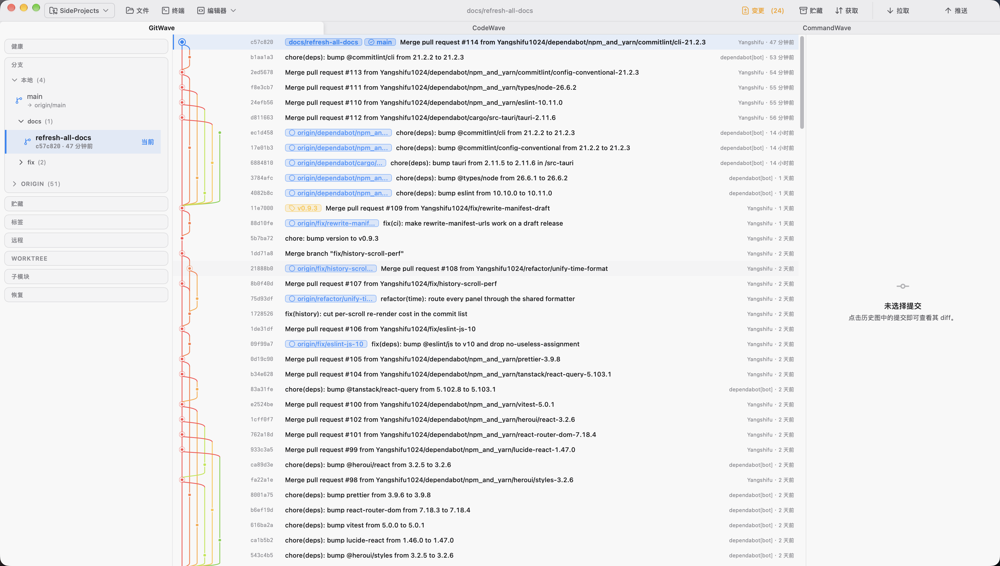

# GitWave

> Local-first Git client with AI collaboration. Website: **[gitwave.work](https://gitwave.work)**

**Status:** v0.9.4 · [Release notes](https://github.com/Yangshifu1024/GitWave/releases) · [Product scope](./docs/pm/core/01-features.md) · [Engineering decisions](./docs/tech/README.md)

### What's new in v0.9.x

- **v0.9.4** — unresolved index conflicts now appear in the Changes count and open directly in the conflict editor, even when no merge is in progress; Pull stops before stash or fetch and explains what to resolve
- **v0.9.3** — update checks work again: the updater manifest now points at plain release download links (v0.9.2 published API URLs, which answer 403 without a User-Agent header); the commit list stays smooth while scrolling large repositories; every panel formats its timestamps through one shared formatter; the icon family moved to lucide 1.x
- **v0.9.2** — stash panel reworked: every stash has a permanently visible row of labelled actions (View / Apply / Apply & delete / Delete) and a detail window with its file list beside the diff; apply pre-checks a working copy that has uncommitted changes and drop asks for confirmation before it runs; files saved as untracked now appear in the stash contents instead of staying invisible
- **v0.9.1** — the repository tab strip scrolls horizontally with the mouse wheel once its tabs overflow the window, and pulls the active tab back into view

Older releases are in the [release notes](https://github.com/Yangshifu1024/GitWave/releases).



## Download

Installers for macOS (Apple silicon, signed & notarized), Windows (NSIS) and Linux (deb / rpm / AppImage) are on <https://gitwave.work> and the [GitHub Releases](https://github.com/Yangshifu1024/GitWave/releases/latest) page.

## Features

- **Workspace management** — multiple workspaces, drag-reorderable repo tabs that scroll horizontally with the mouse wheel once they overflow the window (the active tab stays in view), adding several local repositories at once (already-added paths and repeats inside the batch are skipped, unusable paths are reported without failing the batch), per-workspace AI context; a workspace is an abstraction, not a directory
- **Working copy** — stage / unstage, discard, ignore, commit with conventional-commit type chips (amend the last commit included), commit message AI assist
- **Branches & sync** — create / switch / delete / rename / set upstream tracking (the picker lists every remote-tracking branch, `origin/main` included), double-click a remote branch to create its tracked local branch and switch to it (DWIM), push / pull with a target-remote picker, tag pushes that send only the tags on the pushed commit (conflicting tags are skipped and named instead of failing the batch), fetch across all remotes with stale tracking-ref pruning, time-boxed network syncs with an in-flight cancel button, an in-app auth prompt that collects a username / token and retries in place when a remote challenges for credentials (optionally saved to your system keychain), merge (ff & no-ff) with a conflict panel that also exposes unresolved index entries outside an active merge, and a collapsible sidebar that groups prefixed branches into folders and auto-expands to the branch you check out
- **History** — commit graph with fork-style edges, commit details, blame, reflog, tags, and right-click menus on commits / branch-tag badges (checkout, cherry-pick, revert, reset, copy info) that reveal the checked-out branch in the sidebar; ref badges merge tracked remotes into a single synced badge on a nine-colour lane palette
- **Diff viewer** — side-by-side and unified views, character-level highlighting inside changed lines, per-hunk operations, and side-by-side image diffs (old / new versions rendered for png / jpg / gif / webp / bmp / ico / svg — for unstaged changes the new side reflects the live worktree)
- **Advanced Git** — stash (scoped to the active repo; each entry opens a detail window with its file list and diff, its actions are labelled buttons with tooltips, apply pre-checks a working copy that has uncommitted changes and drop confirms before running, and files saved as untracked are listed), interactive rebase, worktrees, submodules, LFS, remotes, .gitignore editor, Git hooks panel, repo health checks
- **AI collaboration** — BYOK provider setup, commit explain, AI-drafted PR descriptions; diffs stay local unless you send them to your chosen provider. AI replies in Chinese / Japanese / Korean / English per your preference
- **Automatic updates** — in-app check for updates with signed downloads and one-click install (macOS / Windows / AppImage); deb / rpm installs get update prompts pointing at the releases page
- **Background refresh** — auto refresh keeps every repository in the workspace current on a configurable interval (default 5 minutes), fetching each repo best-effort; ⌘R / Ctrl+R refreshes the active repo on demand
- **Proxy-aware networking** — AI requests, sync, LFS and update checks follow the OS system proxy (Windows / macOS) or a manual proxy URL you set in Settings → Network, effective immediately; loopback addresses (local Ollama etc.) always bypass it
- **SSH key management** — generate / import keys, per-repo SSH configuration
- **Platform UX** — command palette, menu bar app mode, themes plus UI / monospace font family and size settings, one-click open of the active repo in the system file manager, a detected terminal, or a detected code editor (VS Code / Zed / VSCodium), Chinese / English interface with instant switching, and a self-drawn title bar that merges the app menu and the operation bar into a single row (traffic lights / window controls kept clear)

## Tech stack

- **Frontend:** React 19 + TypeScript 6 + Vite 8, Tailwind CSS 4 + HeroUI v3, zustand, TanStack Query / Virtual
- **Backend:** Rust + [Tauri 2](https://tauri.app), clean-architecture layers (`domain` / `application` / `infrastructure`), `git2` (vendored libgit2 + libssh2 + OpenSSL) — no system Git dependency
- **Testing:** Vitest (unit); Playwright end-to-end tests have a script but no suite yet

## Quick start

Prerequisites:

- Rust stable ([rustup](https://rustup.rs))
- Node.js 22 (the version CI uses)
- macOS: Xcode command line tools (`xcode-select --install`)
- Linux: `webkit2gtk-4.1-dev`, `build-essential`, `cmake`, `curl`, `wget`, `file`, `libssl-dev`, `libxdo-dev`, `libayatana-appindicator3-dev`, `librsvg2-dev`, `patchelf`
- Windows: WebView2 runtime + MSVC build tools

```bash
pnpm install
pnpm tauri dev
```

## Scripts

| Command | What it does |
|---|---|
| `pnpm dev` | Vite dev server (frontend only, no IPC) |
| `pnpm build` | TypeScript check + Vite production build |
| `pnpm preview` | Serve the production build locally |
| `pnpm tauri dev` | Tauri app in dev mode (frontend + Rust core) |
| `pnpm tauri build` | Tauri production build (.dmg / .exe / .deb / .rpm / .AppImage) |
| `pnpm lint` | ESLint (`lint:fix` to auto-fix) |
| `pnpm format:check` | Prettier check (no write) |
| `pnpm format` | Prettier write |
| `pnpm typecheck` | TypeScript check |
| `pnpm test` | Vitest unit tests (`test:watch` for watch mode) |
| `pnpm test:e2e` | Playwright end-to-end tests (no suite yet) |
| `pnpm bump <x.y.z>` | Bump the version in the four version files |

Rust commands (run inside `src-tauri/`):

| Command | What it does |
|---|---|
| `cargo check --all-targets` | Type check |
| `cargo clippy --all-targets -- -D warnings` | Strict lint |
| `cargo test --all-targets` | Run all tests |
| `cargo fmt` | Format Rust sources |

## Quality gates

`make` wraps the same gates CI runs. The one to remember:

```bash
make check   # fmt-check + lint + test, writes nothing — the pre-delivery gate
```

| Target | What it does |
|---|---|
| `make check` | `fmt-check` + `lint` + `test` (the CI-equivalent gate) |
| `make fmt-check` | Prettier check + `cargo fmt --check` |
| `make lint` | ESLint + clippy + typecheck + `cargo check` |
| `make test` | Vitest + `cargo test --all-targets` |
| `make format` | Prettier write + `cargo fmt` (rewrites files) |
| `make build` | format + lint + test, then `pnpm tauri build` |
| `make dev` | `pnpm tauri dev` (no pre-checks) |

A `pre-commit` hook runs a subset of these on `git commit` — see [CONTRIBUTING.md](./CONTRIBUTING.md). Markdown is excluded from Prettier (`.prettierignore`), so documentation is reviewed by hand.

## CI

Workflows live in `.github/workflows/`:

- **lint / test** — on every push to `main` and every PR: `rust-lint` + `frontend-lint`, `rust-test` + `frontend-test`, each on a macOS / Ubuntu / Windows matrix. Pure-documentation changes (`site/**`, `docs/**`, `**.md`) are skipped
- **build** — on tag push: builds macOS (aarch64), Linux (deb / rpm / AppImage) and Windows (NSIS); when all three pass, a **draft GitHub release** is created with all artifacts and auto-generated release notes, and the updater manifest's download URLs are then rewritten to plain `releases/download` links (tauri-action writes asset-API URLs, which answer 403 without a User-Agent header and count against the unauthenticated API quota). macOS builds are signed and notarized via repository secrets (`APPLE_*`, `KEYCHAIN_PASSWORD`), and OpenSSL/libgit2 are statically linked so binaries are self-contained
- **pages** — deploys `site/` to GitHub Pages on push to `main`

### Cutting a release

1. Bump the version everywhere with `pnpm bump <x.y.z>` — it rewrites `package.json`, `src-tauri/tauri.conf.json`, `src-tauri/Cargo.toml` and refreshes the `gitwave` entry in `src-tauri/Cargo.lock`. Never edit versions by hand; `pnpm-lock.yaml` is untouched (it does not record the root package's own version)
2. Sync the user-facing surfaces: this README's **Status** line and its **What's new** list, and `site/index.html` (version badge, `Latest release`, feature cards)
3. Commit, then tag and push:
   ```bash
   git tag -a v0.x.0 -m "v0.x.0"
   git push origin main v0.x.0
   ```
4. When CI is green, find the draft under Releases, check that all three platforms' assets are present and that `latest.json` carries all three keys with non-empty signatures, then publish
   - Publishing the draft also publishes `latest.json` — the manifest the in-app updater polls; existing installs pick the new version up from there
   - Updater artifacts (`.app.tar.gz` / `.sig` / `-setup.exe.sig` / `latest.json`) are produced by CI; local `tauri build` now requires `TAURI_SIGNING_PRIVATE_KEY` (and `TAURI_SIGNING_PRIVATE_KEY_PASSWORD` if the key is encrypted) exported in the shell: `export TAURI_SIGNING_PRIVATE_KEY=$(cat ~/.tauri/gitwave.key)`
   - The full checklist, including how to repair a bad `latest.json` before publishing, lives in [`.agents/skills/gitwave-release/SKILL.md`](./.agents/skills/gitwave-release/SKILL.md)

Per AGENTS.md, **AI agents must not commit / push / merge** — humans gate every change to `main`.

## Documentation

- Website — <https://gitwave.work> (landing page & downloads)
- [`docs/pm/core/`](./docs/pm/core/README.md) — product management (features, scope, roadmap)
- [`docs/tech/`](./docs/tech/README.md) — engineering decisions (architecture, selection, ADRs, conventions)
- [`docs/design/`](./docs/design/00-overview.md) — UI/UX overview (3-pane layout, tokens, components)
- [`docs/tasks/`](./docs/tasks/README.md) — per-task plans and reviews
- [`AGENTS.md`](./AGENTS.md) — workflow rules and agent boundaries
- [`CONTRIBUTING.md`](./CONTRIBUTING.md) — branch, commit and review conventions

## License

[MIT](./LICENSE) © Yangzhenbiao
